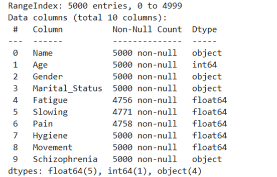
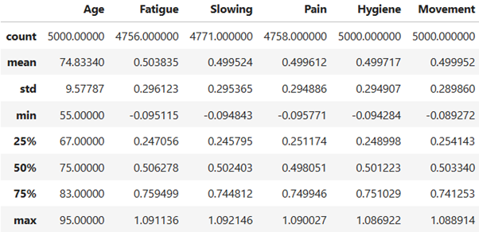
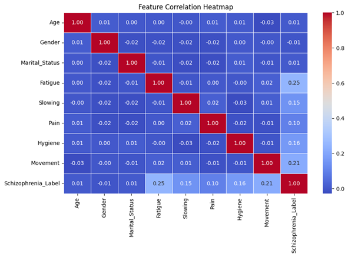
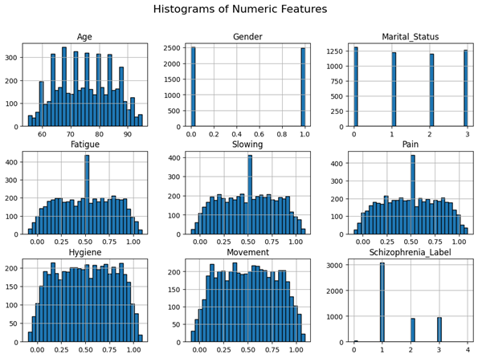
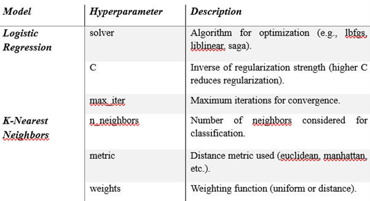
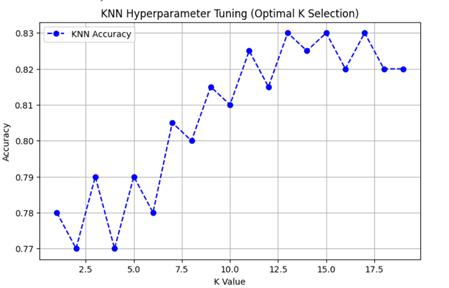
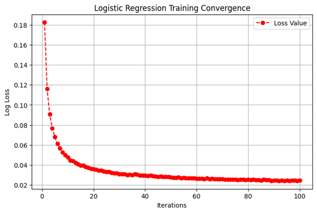
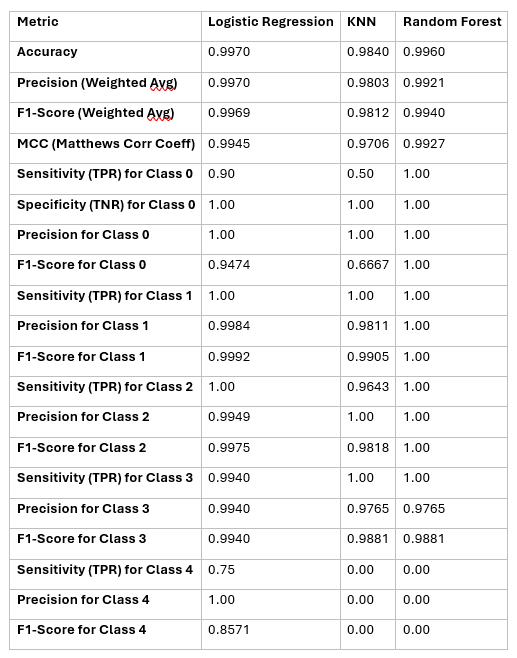
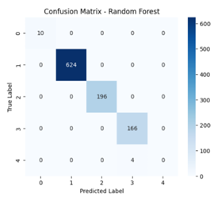

# Schizophrenia Prediction using Machine Learning
This repository presents a machine learning-based approach for the early diagnosis of schizophrenia. By leveraging behavioral and clinical symptom data, we train and evaluate classification models to assist healthcare professionals in detecting schizophrenia risk more accurately and efficiently.
## Problem Statement
Schizophrenia is a complex mental disorder characterized by hallucinations, delusions, and cognitive impairments. Traditional diagnosis relies heavily on subjective clinical evaluation, which may delay early intervention. This project applies machine learning to provide a data-driven solution for early detection using patient symptoms and demographic features.

## Dataset & Sources
The dataset used in this study consists of demographic and clinical symptom features that contribute to schizophrenia risk classification. The features capture various behavioural and physiological indicators such as fatigue levels, movement patterns, hygiene scores, pain levels, and cognitive impairments. The target variable classifies individuals into different schizophrenia risk categories, enabling the model to learn patterns associated with the disorder.

## Algorithm Used
### **1. Logistic Regression**
Logistic Regression is a statistical model used for binary classification problems. It estimates the probability that a given input belongs to a particular class using the sigmoid function.

### **2. K-Nearest Neighbours (KNN)**
K-Nearest Neighbours (KNN) is a non-parametric algorithm that classifies a data point based on the majority class among its k nearest neighbours.

### **3.	Random Forest Classifier**
Random Forest is an ensemble learning method that builds multiple decision trees and aggregates their results to improve classification performance.

## Hyperparameter Description and Training Process
The table below summarizes the hyperparameters used in Logistic Regression and K-Nearest Neighbors (KNN):

## Model Training
### **(A) KNN Hyperparameter Tuning Graph**
•	The accuracy of KNN was plotted against different values of n_neighbors.
•	The optimal k value was selected based on the highest accuracy.

### **(B) Logistic Regression Training Convergence**
•	The training process of Logistic Regression was visualized using the convergence plot.
•	It shows how the model’s loss decreases over iterations.

## Results

## Confusion Matrices

